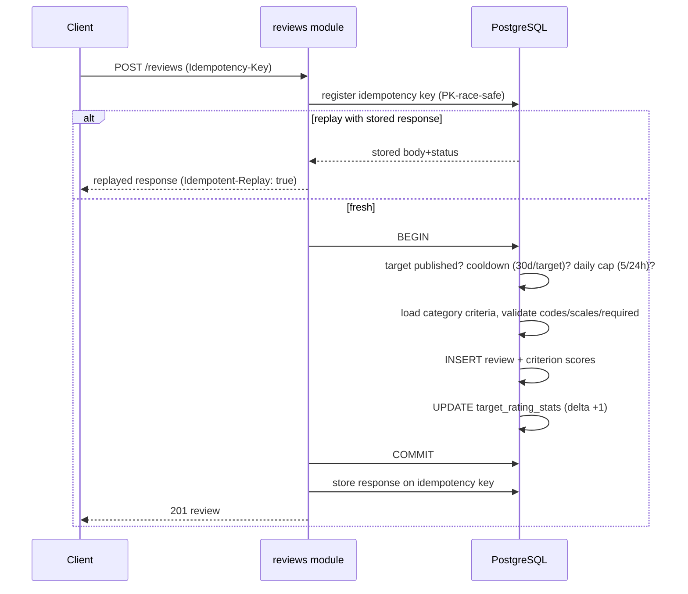
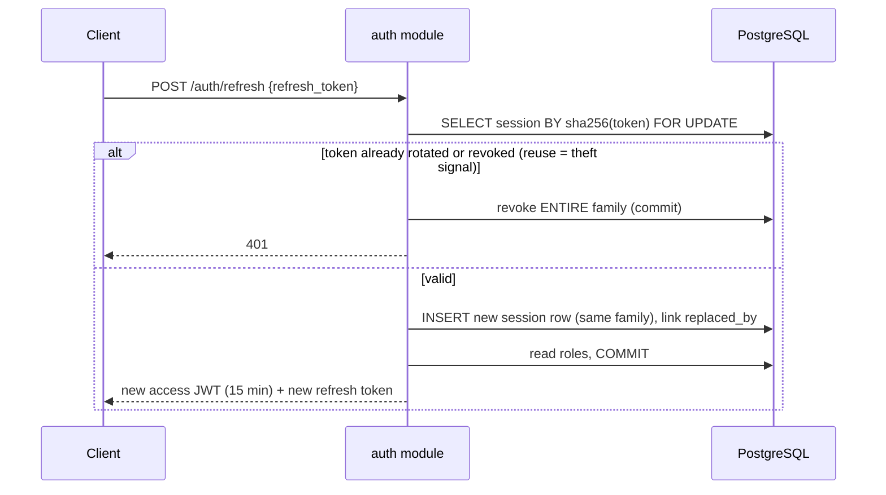
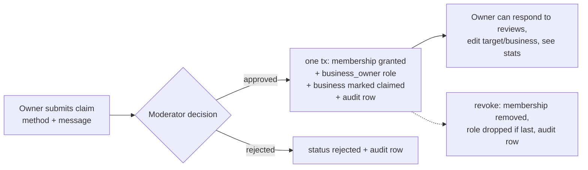
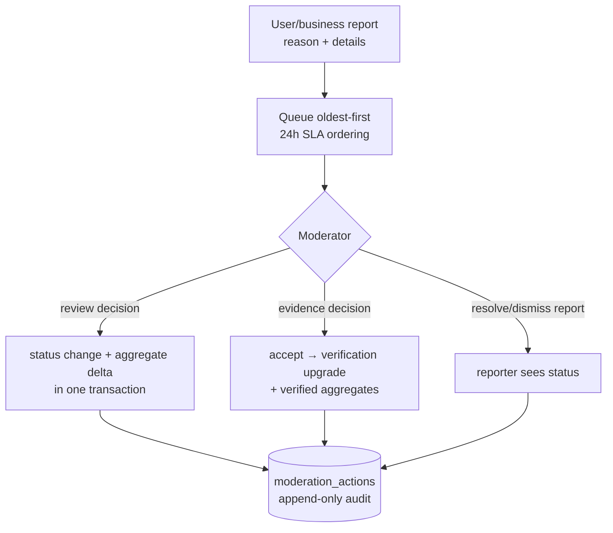
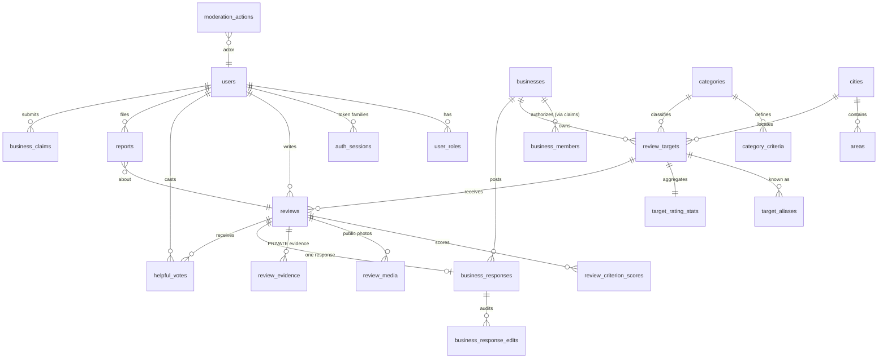

# Architecture

Adera is a **modular monolith**: one deployable Go service, PostgreSQL for
data + search + aggregation, S3-compatible object storage for media. No Redis,
no Elasticsearch, no queues — PostgreSQL demonstrably covers MVP search,
filtering, transactions, and aggregation needs (see
docs/research/tech-stack-decisions.md for the reasoning and measured
trade-offs).

## System overview

```mermaid
flowchart LR
    Client[Mobile-first web client\n(next phase)] -->|JSON /api/v1| API

    subgraph API[Go service — modular monolith]
        direction TB
        MW[middleware: recover, request-id,\nmetrics, logging, headers, CORS,\ntimeout, authenticate]
        MODS[auth · users · categories · locations\ntargets · businesses · claims · reviews\nratings · search · media · moderation · admin]
        PLAT[platform: config · web · security\ndatabase · ratelimit · storage · logging]
        MW --> MODS --> PLAT
    end

    API -->|pgx pool| PG[(PostgreSQL 18\nFTS 'simple' + pg_trgm + am_fold)]
    API -->|presign / finalize| S3[(S3-compatible storage\npublic + private buckets)]
    Client -->|presigned POST upload| S3
    Ops[Prometheus] --> |/metrics| API
```

## Module layout

```
cmd/api                 serve | migrate | seed
internal/app            wiring shared by cmd and integration tests
internal/platform/      config, web (errors/JSON/middleware/pagination/metrics),
                        security (argon2id, JWT), database (pool + migrator),
                        ratelimit, storage (minio + memory), logging, testdb
internal/<capability>/  auth, users, categories, locations, businesses,
                        targets, reviews, ratings, search, media, claims,
                        moderation, admin
migrations/             embedded, versioned, up-only SQL
```

Each capability module owns its domain validation, SQL, HTTP transport, and
authorization checks (`models.go` / `service|repo.go` / `handler.go`).
Dependencies point downward only (modules → platform); the few cross-module
edges are explicit constructor parameters (e.g., moderation takes the reviews
repo so status changes and aggregate updates share a transaction). There are
no `utils` packages and no interfaces without a second implementation (the
two interfaces — `storage.Store`, `ratelimit.Limiter` — each have real
substitutes: MinIO/memory, keyed/unlimited).

Layering rule: HTTP handlers never contain SQL or domain rules; services never
import `net/http` types beyond error mapping. Services return `*web.Error`
values with stable machine codes; the transport layer serializes them
uniformly with request IDs.

## Key design decisions

| Decision | Rationale |
|---|---|
| stdlib `net/http` ServeMux (1.22+ patterns) | No router dependency; method+wildcard routing suffices |
| Hand-written parameterized SQL (no sqlc/ORM) | Dynamic filters compose poorly in codegen; SQL stays reviewable next to its module |
| ~100-line embedded migration runner | Advisory lock + per-file transactions + `schema_migrations`; zero dependency tree; up-only (rollbacks are roll-forward) |
| Aggregates as transactional deltas | `target_rating_stats` updated in the same tx as every review mutation; CHECK constraints + recount tests guard drift |
| JWT (HS256) access + opaque rotating refresh tokens | Single verifier service; token families with reuse detection (see below) |
| Everything stages to the private bucket | No user upload is ever directly public; public media is re-encoded (EXIF stripped) before promotion |
| In-process rate limiting | Correct for single instance; `Limiter` interface is the Redis swap-point at scale-out |

## Review submission flow



## Authentication refresh flow



## Business claim flow



## Moderation flow



## Entity relationships (core)



## Reliability & observability

Structured JSON logs (slog, redaction layer), request IDs on every response,
`/health` (liveness), `/ready` (DB ping), `/metrics` (Prometheus: request
counts/latency by route pattern, in-flight), panic recovery, config validation
at startup, HTTP server timeouts, per-request 30s context deadline inherited
by all queries, pooled connections with lifetime/idle limits, graceful
shutdown on SIGINT/SIGTERM.

## Search

`am_fold()` (SQL, migration 0001) folds Amharic homophone series
(ሐ/ኀ→ሀ, ሠ→ሰ, ዐ→አ, ፀ→ጸ) and maps Ethiopic punctuation to spaces; queries and
index expressions both pass through `am_fold(lower(...))`. Relevance = FTS
('simple' config) rank ×2 + word-similarity over names and aliases + a small
rating boost. Alias rows carry transliterations ("Bole Cafe" ⇄ "ቦሌ ካፌ") —
the practical answer to mixed-script search.
