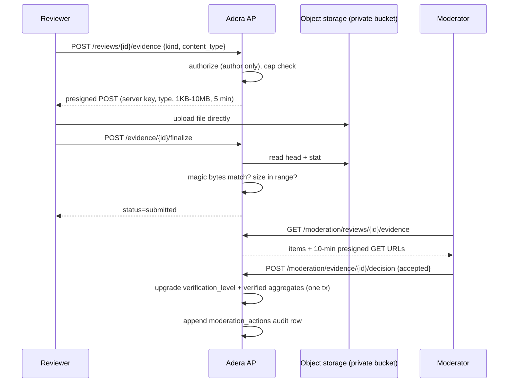

# Review Verification Model

Adera grades every review's trustworthiness with an explicit
`verification_level`. Levels only ever move **up**, each upgrade has a defined
trigger, and **no review is labeled verified until the required process has
succeeded**.

## Levels

| Level | Meaning | How it is granted | Counts as "verified" in aggregates |
|---|---|---|---|
| `unverified` | Default | — | No |
| `media_attached` | Public photo(s) attached | Automatic when a public photo passes the finalize pipeline (signature check, decode, re-encode) | No — a photo adds context, not transaction evidence |
| `receipt_submitted` | Receipt / order / product / service-result evidence verified | User submits private evidence; **a moderator accepts it** | Yes |
| `location_verified` | Presence at the location confirmed | User submits `location_qr` evidence; **a moderator accepts it** | Yes |
| `partner_verified` | Transaction observed via a partner integration | Future phase; the level exists in the schema so ordering is stable | Yes |

Order: `unverified < media_attached < receipt_submitted < location_verified <
partner_verified` (`internal/reviews.levelRank`). `UpgradeVerification` is
idempotent and refuses downgrades; when a published review crosses into the
verified set, verified aggregates adjust in the same transaction.

## Evidence privacy (non-negotiable)

Verification evidence routinely contains phone numbers, payment references,
names, and order identifiers, so:

- Evidence lives **only in the private bucket**, uploaded via presigned POST
  to a server-chosen key, and is **never re-encoded** (originals preserved for
  verification integrity) and **never publicly readable**.
- Access is restricted to the review's author and moderators, via presigned
  GET URLs valid for 10 minutes. Presigned URLs are never logged.
- Public review APIs never include evidence objects, keys, or URLs — enforced
  by construction (separate tables: `review_media` vs `review_evidence`) and
  by an integration test that fetches evidence as a stranger and gets 403.

## Public media pipeline (contrast)

Public review photos stage into the **private** bucket, then the finalize step
validates magic bytes against the declared type, guards against decompression
bombs, decodes, and **re-encodes** the pixels — which drops every metadata
segment (EXIF/GPS/XMP) by construction — before the clean copy is written to
the public bucket and the staging object deleted. Accepted types: JPEG, PNG
(WebP additionally accepted for private evidence, where no re-encode occurs).

## Verification flow

Staged media and evidence tickets expire after ten minutes. Expired private
objects and their staged database rows are removed before another ticket is
issued, so abandoned uploads do not consume a review's upload allowance.

## Business claims (identity verification for owners)

Claims are a separate verification track (`internal/claims`): request with
method (`document | phone | email | other`) and message → moderator decision.
Approval atomically grants business membership + the `business_owner` role and
marks the business `claimed`; revocation removes control. Claiming **never**
grants moderation permissions. Every decision is audited.
